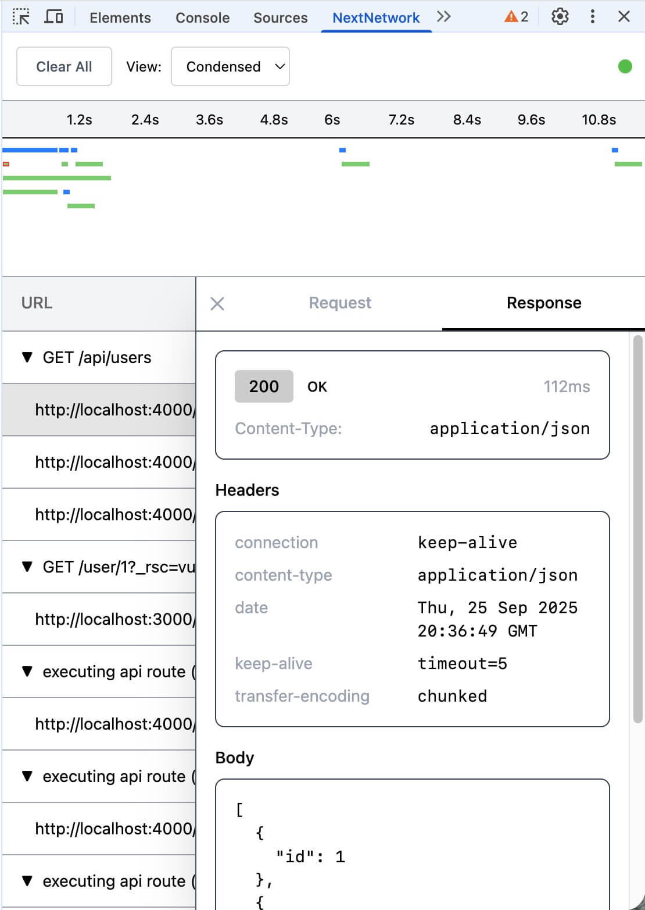

<p align="center">
  
</p>

# Next Network

Next Network is a browser extension that allows to track server-side network activity resulting from client-side requests for Next.js (v14+) applications.

<p align="center">
  
</p>

## How It Works

Next Network consists of two components working together:

1. **Next.js Plugin**: Automatically instruments your Next.js application using OpenTelemetry to capture all HTTP requests
2. **Browser Extension**: Connects to your instrumented application to visualize network activity in real-time

The plugin runs a WebSocket server on port 3300 that broadcasts network events to the browser extension, which displays them in an intuitive DevTools panel.

## Getting started

### 1. Grab the browser extension

The extensions is current available for Firefox, Chrome, and other Chromium-based browsers.

- [Chrome Web Store](https://chromewebstore.google.com/detail/next-network/jfdfcgpbpbbemkmdffgliagfoggdjmmc)
- [Firefox Browser Add-ons](https://addons.mozilla.org/en-US/firefox/addon/next-network/)

### 2. Install the Next.js Plugin

```bash
npm install next-network-devtools-plugin
```

### 3. Configure Instrumentation

Create or update your `instrumentation.(js|ts)` file in your Next.js project root:

```typescript
export async function register() {
  if (process.env.NEXT_RUNTIME === "nodejs" && process.env.NODE_ENV === "development") {
    await import("next-network-devtools-plugin").then(({ register }) => {
      register();
    });
  }
}
```

### 4. Add Next.js config wrapper

In your `next.config.(js|ts)` wrap your configuration with `withNextNetwork` function:

```typescript
import { withNextNetwork } from 'next-network-devtools-plugin';

const nextConfig = withNextNetwork({
 // your existing next.js config
});

export default nextConfig;
```

This step is not strictly necessary but will remove warnings related to the OpenTelemetry libraries that are used behind the scenes.

## License

This project is licensed under the MIT License - see the [LICENSE](LICENSE) file for details.

## Acknowledgments

- [OpenTelemetry](https://opentelemetry.io/) for application instrumentation
- [WXT](https://wxt.dev/) for cross-browser extension development
- [MSW](https://mswjs.io/) for HTTP request interception
